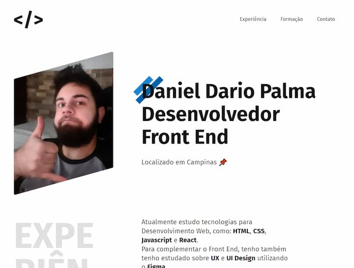

<h1 align="center"> Projeto Portfólio  - Origamid </h1>

## Projeto

Projeto com intuito de demonstrar/ensinar sobre HTML e CSS básico, através da criação de um portfólio.

Para acessar o projeto, basta <a href="https://danieldpalma.github.io/portfolio-origamid/" target="_blank">clicar aqui</a>.

Projeto criado no curso de HTML e CSS para Iniciantes da [Origamid]('https://www.instagram.com/origamid').

Já na criação de prototipo do layout foi feito através do curso de UI Design para Iniciantes.

## Tecnologias

Para este projeto foram utilizados as seguintes tecnologias:

- HTML
- CSS
- Figma

### Status: Concluido
